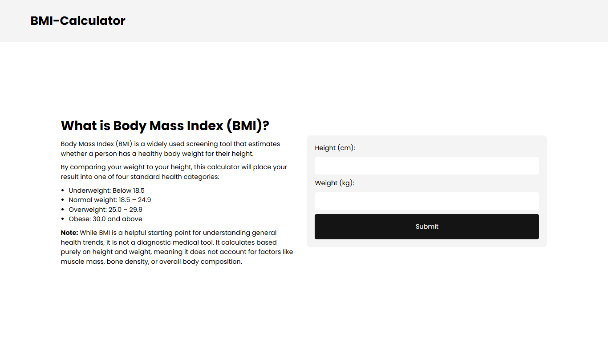
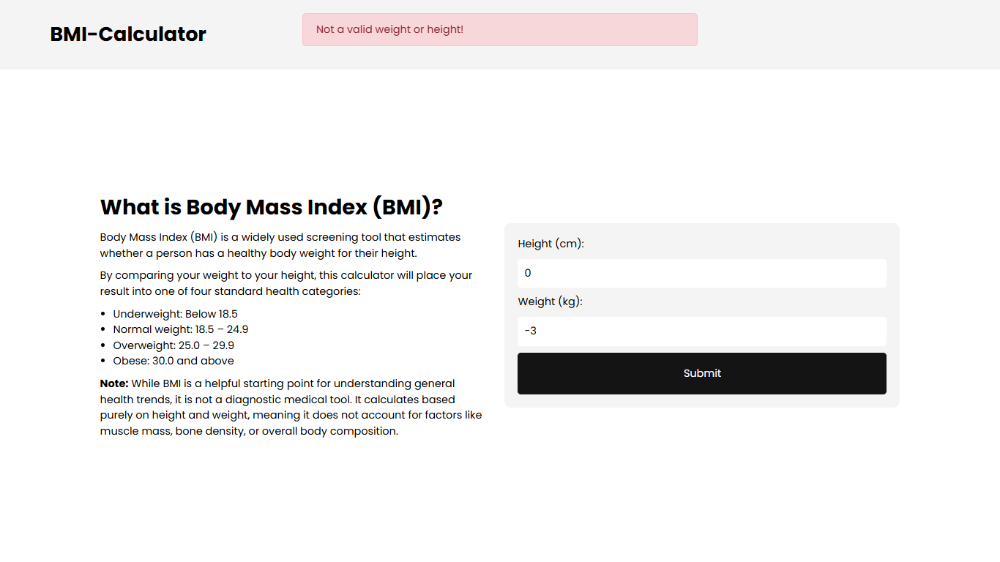
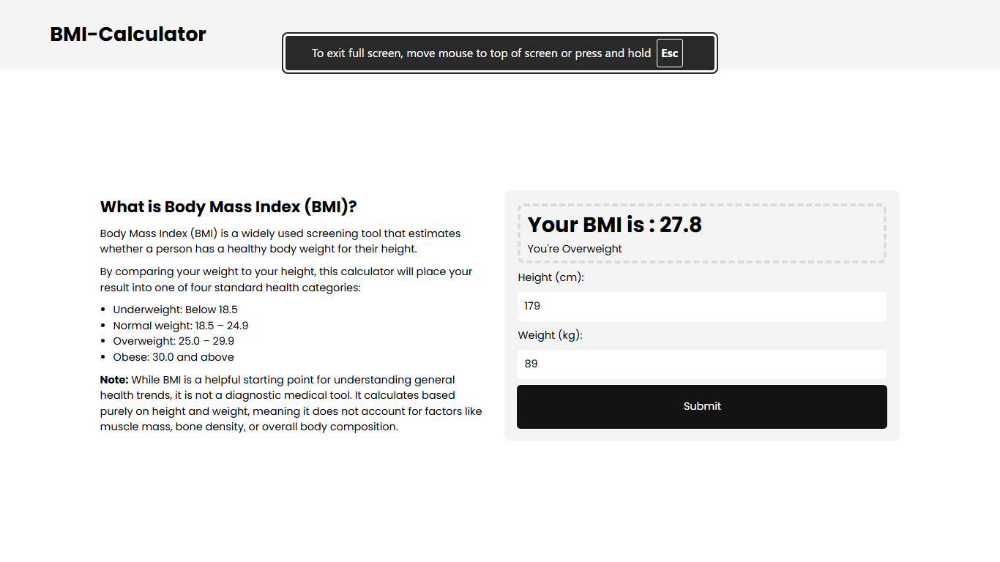

# BMI Calculator

A clean, professional health utility that calculates a user's Body Mass Index (BMI) based on their height and weight, providing immediate, categorized feedback.

## Live Demo

[https://ifeanyi234.github.io/bmi-calculator/]

## Features

- **Accurate Calculation:** Computes BMI using standard mathematical formulas and rounds the output to one decimal place for clean readability.
- **Dynamic Categorization:** Automatically classifies the calculated BMI into standard health categories (Underweight, Normal weight, Overweight, Obese).
- **Input Validation:** Prevents form submission and alerts the user if inputs are empty, zero, negative, or non-numeric.
- **Split-Screen UI:** Features an educational layout pattern that provides context on what BMI is alongside the interactive calculator.

## Screenshots

**Default Form State:**


**No-Input Error State:**


**Invalid Errorm State:**


**Calculated Result:**


## Tech Stack

- **Frontend:** HTML5, CSS3, Vanilla JavaScript

## Installation & Running Locally

Because this is a Vanilla JavaScript project without build tools, setup is extremely simple:

1. Clone the repository:
   ```bash
   git clone https://github.com/ifeanyi234/bmi-calculator.git
   cd bmi-calculator
   ```
   Open index.html directly in any modern web browser.

## Known Limitations

- **Unit Support:** The current implementation is optimized for metric units.
- **Physiological Factors:** The calculation provides a general assessment and does not account for individual variations such as muscle mass, bone density, or age.

## Future Improvements

- **Reset Functionality:** Add a dedicated "reset" button that instantly clears all inputs and results.
- **Unit Toggle:** Implement a feature to switch between Metric (cm/kg) and Imperial (in/lbs) units.
- **Extended Analytics:** Provide visual indicators or charts showing where the user falls on the BMI spectrum.
